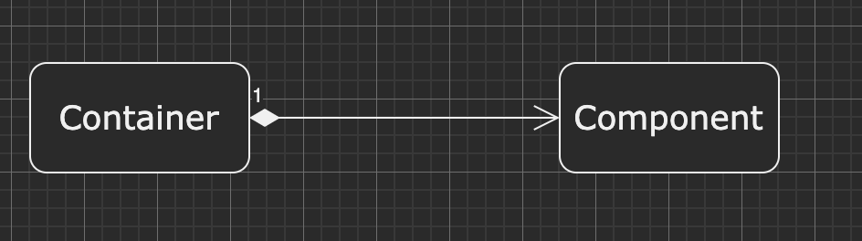
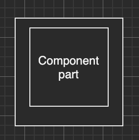
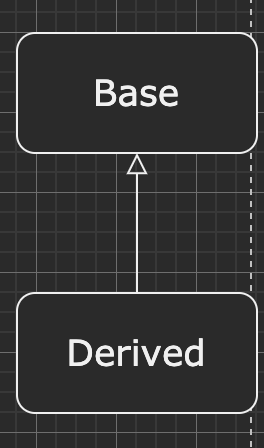
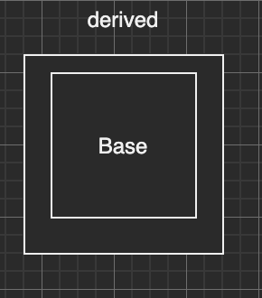
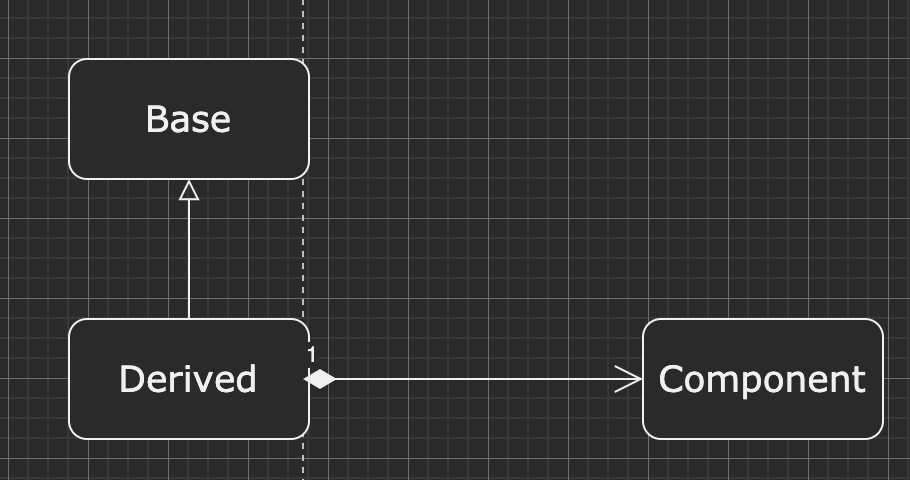
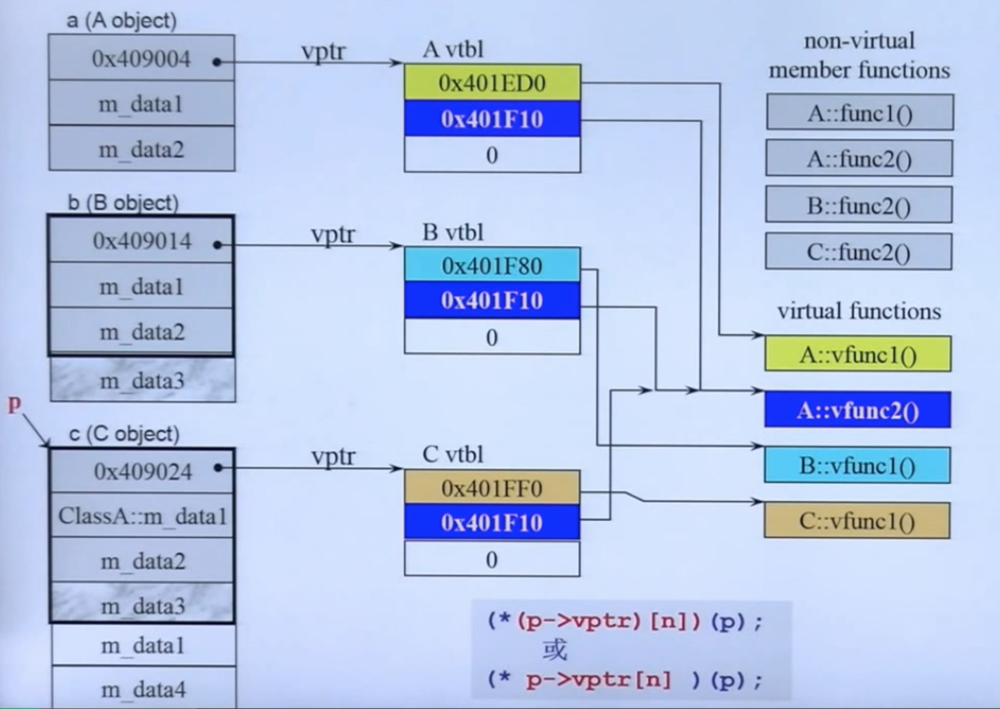

# c\++面向对象
所有C\++的类成员函数，都隐含一个`this`指针的参数，指向`class object`地址。
## 返回引用
```cpp
/**
 * @file tempobject.cc
 * @author koritafei (koritafei@gmail.com)
 * @brief 临时对象，返回refecnce or value
 * @version 0.1
 * @date 2021-04-05
 *
 * @copyright Copyright (c) 2021
 *
 */

#include <iostream>

class Complex {
public:
  Complex(double real, double imp) : _real(real), _imp(imp) {
  }

private:
  double _real;
  double _imp;
};

double &result(double x, double y) {
  double sum = 0.0;
  sum        = x + y;
  return sum; // 返回临时变量的引用，error, 临时变量空间释放，结果可能未知
}

double result_2(double x, double y) {
  return x + y;
}

int main(int argc, char **argv) {
  double x = 1.0, y = 2.0;
  std::cout << result(x, y) << std::endl;
  std::cout << result_2(x, y) << std::endl;
}
```
### 拷贝构造，赋值构造
`class with pointer members`必须有`copy constructor`和`copy opeartor=`构造函数。
如果不重载这两个函数，编译器生成的`constructor`只进行浅拷贝，复制指针。
```cpp
/**
 * @Copyright (c) 2021  koritafei
 * @file stringdemo.cc
 * @brief 
 * @author koritafei (koritafei@gmail.com)
 * @version 0.1
 * @date 2021-04-13 10:04:31
 * 
 * 
 * @par 修改日志:
 * <table>
 * <tr><th>   Date                  <th>  Version    <th>              Author                     <th>   Description
 * <tr><td>  2021-04-13 10:04:31    <td>    1.0      <td>      koritafei(koritafei@gmail.com)     <td>   default,copy,operator= constructor
 * </table>
 * */
#include <iostream>


class String {
public:
  String(const char *cstr = 0);
  String(const String &str);
  String &operator=(const String &str);

  virtual ~String();

  char *get_c_str() const {
    return m_data;
  }

private:
  char *m_data;
};

String::String(const char *cstr) {
  if (cstr) {
    m_data = new char[strlen(cstr) + 1];
    strcpy(m_data, cstr);
  } else {
    m_data    = new char[1];
    m_data[0] = '\0';
  }
}

String::~String() {
  delete[] m_data;
}

inline String::String(const String &str) {
  m_data = new char[strlen(str.m_data) + 1];
  strcpy(m_data, str.m_data);
}


inline String &String::operator=(const String &str) {
  if (this == &str) {
    return *this;
  }

  delete []m_data;
  m_data = new char[strlen(str.m_data)+1];
  strcpy(m_data, str.m_data);

  return *this;
}


int main(int argc, char **argv) {
}
```
对`new`函数的操作展开：
**`new:` 先分配`memory`,在调用`constrctor`。**
```cpp
Complex *pc = new Cpmplex(1, 2);
```
编译器处理为：
```cpp
Complex *pc;
void *mem = operator new(sizeof(Compex)); // 其内部调用的仍为：malloc(n)
pc = static_cast<Complex *>(mem);
pc->Complex::Complex(1,2); // Complex(pc,1,2);
```
对`delete`操作：
**先调用析构函数，在释放内存。**
```cpp
delete pc;
```
编译器扩展为:
```cpp
Complex::~Complex();
operator delete(pc);
```
### 内存分配
1. `malloc`指定大小，是因为`malloc`分配空间是从`OS`内存的空闲链表上获取到的内存。分配空间分为两个部分：
   管理空间(包含当前空间大小，下一个被分配的内存空间地址等)，使用空间(申请的内存大小)。
2. `free`释放时，仅需指定分配空间对应的地址即可。大小等可以通过管理空间获得。
### 面向对象
1. 组合(`Composition`), 表示`Has-a`的关系。一个对象中包含另一个对象。
  
  
构造函数与析构函数的调用：
构造函数：由内而外。
`Container`的构造函数，先调用`Component`的构造函数，在调用自己的构造函数。
析构函数：由外而内。
`Container`的析构函数，先调用自己，在执行`Component`的析构函数。
2. 委托(`Delegation`), 表示利用引用或组合实现的组合。
   依赖于动态绑定，要求特定的方法可以在运行时调用不同的代码。
```cpp
/**
 * @Copyright (c) 2021  koritafei
 * @file delegation.cc
 * @brief delegation 实现
 * @author koritafei (koritafei@gmail.com)
 * @version 0.1
 * @date 2021-04-15 16:04:14
 *
 * */

#include <functional>
#include <iostream>
#include <string>
#include <vector>
#include <functional>

class IObj {
public:
  virtual int callback(std::string t_data) = 0;
};

class AppleObj : public virtual IObj {
public:
  int callback(std::string t_data) final {
    std::cout << "This is apple obj! Get " <<t_data<< std::endl;
    return 0;
  }
};

class AndroidObj : public virtual IObj {
public:
  int callback(std::string t_data) final {
    std::cout << "This is android obj! Get " << t_data << std::endl;
    return 0;
  }
};

class DeleManger {
public:
  DeleManger() {
  }
  ~DeleManger() {
  }

  void addObj(std::function<int(std::string)> t_dele){
    __dele_list.push_back(t_dele);
  }

  void nofity(std::string t_msg) {
    if (__dele_list.empty()) {
      std::cout << "List is empty" << std::endl;
      return;
    }

    for (auto iter : __dele_list) {
      iter(t_msg);
    }
  }

private:
  std::vector<std::function<int(std::string)>> __dele_list;
};


int main(int argc,char **argv) {
  DeleManger i_delemanger;
  AppleObj apple;
  AndroidObj android;

  using std::placeholders::_1;
  std::function<int(std::string)> i_dele_apple = std::bind(&AppleObj::callback, apple, _1);
  i_delemanger.addObj(i_dele_apple);
  std::function<int(std::string)> i_dele_android = std::bind(&AndroidObj::callback, android, _1);
  i_delemanger.addObj(i_dele_android);

  i_delemanger.nofity("Moile Obj");
}
```
3. 继承(`Inheritance`), 表示`is-a`关系。
```cpp
struct _List_node_base{
  _List_node_base *_M_next;
  _List_node_base *_M_prev;
};

template <typename _Tp>
struct _List_node : public _List_node_base {
  _Tp _m_data;
};
```
继承关系下的构造与析构：
  
  
构造函数：由内而外
先调用`base`的构造函数，在调用`derived`的构造函数。
析构函数：由外而内
先调用`derived`的析构函数，在调用`base`的析构函数。
**`base`的析构函数，一定要设置成`virtual`函数，否则可能引发未定义行为。**
带虚函数的继承：
`non-virtual`函数：不希望`derived`重写的函数。
`virtual`函数：希望`derived`重写的函数，且有默认定义。
`pure virual`函数：希望`derived`实现的函数，没有默认定义。
### 转换函数(`conversion function`)
```cpp
/**
 * @Copyright (c) 2021  koritafei
 * @file conversion.cc
 * @brief 转换函数
 * @author koritafei (koritafei@gmail.com)
 * @version 0.1
 * @date 2021-04-15 20:04:85
 *
 *
 * */

#include <iostream>

class Fraction {
public:
  Fraction(int num, int den = 1) : m_numberation(num), m_denominator(den) {
  }

  operator double() const {
    return (double)(m_numberation / m_denominator);
  }

private:
  int m_numberation;  // 分子
  int m_denominator;  // 分母
};

int main(int argc, char **argv) {
  Fraction f(3,5);
  double d = 4 + f; // 调用operator double() 将f转为double
  std::cout << d << std::endl;
}
```
### `non-explicit-one-argument ctor`
```cpp
 Fraction(int num, int den = 1) : m_numberation(num), m_denominator(den) {
  }
  Fraction &operator+(const Fraction &f){
    return Fraction(...);
  }
Fraction f(3,5);
double d = f + 4; // 将4 利用Fraction函数转化为分数形式。
```
如果同时存在`double和operator+`函数时，则编译错误。
标准库中的转换函数：
```cpp
template <class Alloc>
class vector<bool, Alloc>{
  public:
    typedef __bit_reference reference;
  protected:
    reference operator[](size_type n) {
      return *(begin() + difference_type(n));
    }
};

struct __bit_reference {
  unsigned int *p;
  unsigned int mask;


  public:
    operator bool() const {
      return !(!(*p & mask));
    }
};
```
### 智能指针(`pointer-like classes`)
```cpp
template <typename T>
class shared_ptr{
  public:
    T &operator*() const {
      return *px;
    }

    T *operator->()const {
      return px;
    }

    shared_ptr(T *p) :px(p){
    }

  private:
    T *px;
    long *pn;
};
```
迭代器是一种特殊的智能指针。
### 仿函数(`function-like class`)
```cpp
template <class T>
struct identify {
  const T &operator()(const T &x) {
    return x;
  }
};

template <class Pair>
struct select1st {
  const typename Pair::first_type &operator()(const Pair &x) const {
    return x.first;
  }
};

template <class Pair>
struct select2nd {
  const typename Pair::second_type &operator()(const Pair &x) const {
    return x.second;
  }
};
```
仿函数的声明是通过`operator()`来实现的。
#### 模板偏特化
```cpp
/**
 * @Copyright (c) 2021  koritafei
 * @file templatedemo.cc
 * @brief 模板偏特化
 * @author koritafei (koritafei@gmail.com)
 * @version 0.1
 * @date 2021-04-16 10:04:45
 * 
 * 
 * */

#include <iostream>

template <class T>
struct hash{};

template <>
struct hash<char> {
  size_t operator()(char x) const {
    return x;
  }
};

template <>
struct hash<int>{
  size_t operator()(int x) const {
    return x;
  }
};

template <>
struct hash<long> {
  size_t operator()(long x) const {
    return x;
  }
};

int main(int argc, char **argv) {
  std::cout << hash<long>()(1000) << std::endl;
}
```
#### `template template parameler`
```cpp
template <typename T, template <typename T> class Container>
class XCls{
  public:
    ...
  private:
    Container<T> c;
};

template <typename T>
using Lst = list<T, allocator<T>>;
XCls<string, Lst> mylist;
```
#### 不定参数模板(`variadic templates`)
```cpp
/**
 * @Copyright (c) 2021  koritafei
 * @file templatedemo.cc
 * @brief 模板偏特化
 * @author koritafei (koritafei@gmail.com)
 * @version 0.1
 * @date 2021-04-16 10:04:45
 * 
 * 
 * */

#include <iostream>

template <class T>
struct hash{};

template <>
struct hash<char> {
  size_t operator()(char x) const {
    return x;
  }
};

template <>
struct hash<int>{
  size_t operator()(int x) const {
    return x;
  }
};

template <>
struct hash<long> {
  size_t operator()(long x) const {
    return x;
  }
};

template <typename... Types>
void print(const Types&... d) {
  print(d...);
}

template<>
void print() {
  std::cout << "Empty" << std::endl;
}

template <typename T, typename... Types>
void print(const T &firstArg, const Types&... args){
  std::cout << firstArg << std::endl;
  print<Types...>(args...);
}

int main(int argc, char **argv) {
  std::cout << hash<long>()(1000) << std::endl;
  print(1,2,3,4,5);
}
```
通过上述代码可以得知，在使用不定参数时，类似于递归调用，必须定义一个**特化的模板**实现递归结束。
同时必须实现`通用的模板`。
简略版实现：
```cpp
void print() {
  std::cout << "Empty" << std::endl;
}

template <typename T, typename... Types>
void print(const T &firstArg, const Types&... args){
  std::cout << firstArg << std::endl;
  print(args...);
}
```
### 引用(`reference`)
  
构造函数：
**先调用`Base Constructor`, 再调用`Compenent Constructor`，最后调用自己的`Constructor`。**
析构函数：
**先调用自己的`~Constructor`, 在调用`Compenent ~Constructor`，最后调用`Base ~Constructor`。**
### 虚函数指针
```cpp
/**
 * @Copyright (c) 2021  koritafei
 * @file vtbl.cc
 * @brief
 * @author koritafei (koritafei@gmail.com)
 * @version 0.1
 * @date 2021-04-16 15:04:41
 *
 * */

#include <iostream>

class A {
public:
  virtual void vfunc1() {
  }
  virtual void vfunc2() {
  }

  void func1() {
  }
  void func2() {
  }

private:
  int m_data1, m_data2;
};

class B : public A {
public:
  virtual void vfunc2() {
  }

  void func2() {
  }

private:
  int m_data3;
};

class C : public A {
public:
  virtual void vfunc1() {
  }

  void func1() {
  }

private:
  int m_data1;
  int m_data4;
};

int main(int argc, char **argv){
  
}
```
  
通过分析可知，每个类都有自己的一个`vtbl`，不是每个实例。在覆盖`virtual function`时，在`vtbl`中生成一个新的地址，指向对应的虚函数地址。
未被覆盖的虚函数地址，所有的类公用。
### 重载`new 和 delete`
```cpp
void *MyAlloc(size_t size){
  return malloc(size);
}

void myFree(void *ptr) {
  return free(ptr);
}

// 以下函数不可以放在同一个namespace
inline void *operator new(size_t size){
  return MyAlloc(size);
}

inline void *operator new[](size_t size){
  return MyAlloc(size);
}

inline void operator delete(void *ptr) {
  myFree(ptr);
}

inline void operator delete[](void *ptr) {
  myFree(ptr);
}
```


